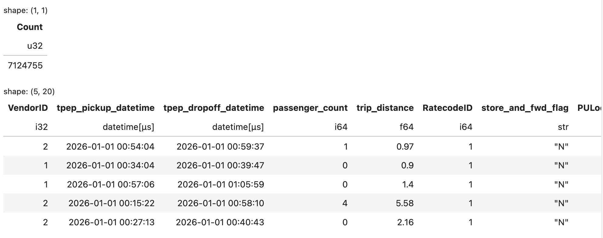
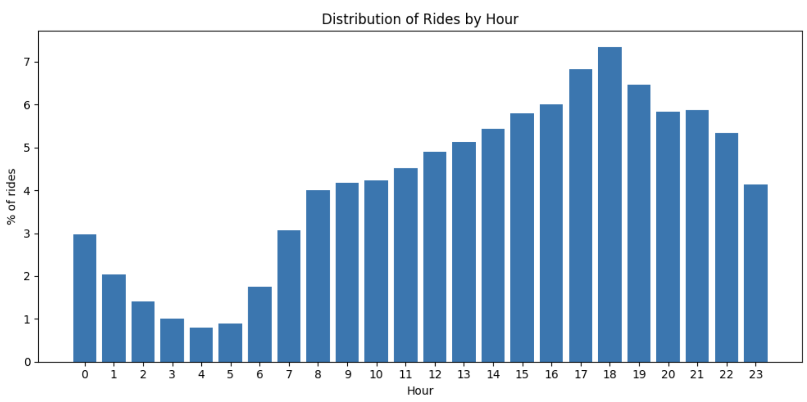
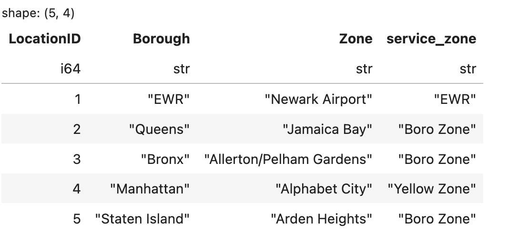
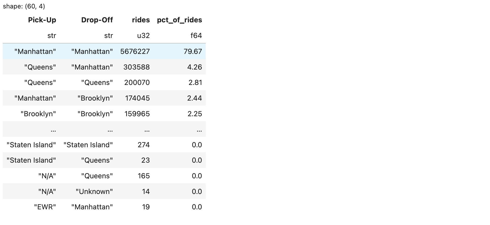
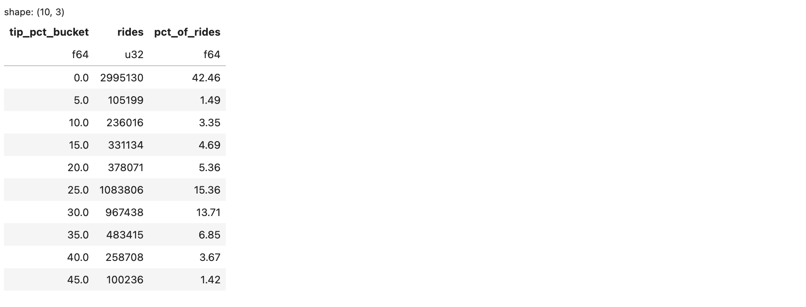
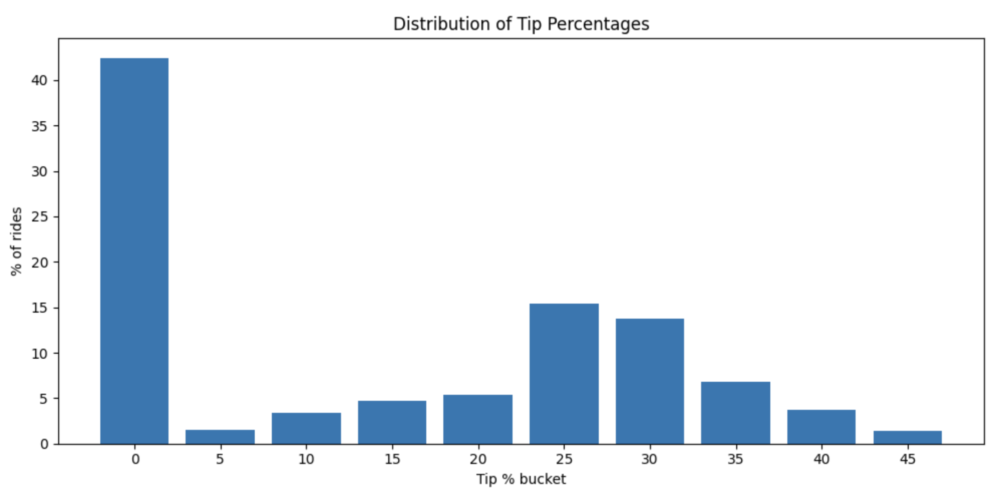

# Polars: A Practical Introduction to Fast DataFrames in Python

I have been analyzing data in Python for more than 10 years. In the beginning, I wrote a lot of custom Python functions for data processing. That approach was flexible and much easier to develop than lower-level languages such as Java or C++, but it was also easy to make mistakes. As datasets grew larger, performance and memory usage became real concerns, especially when working with millions of rows and many columns. Even routine operations such as sorting, grouping,deduplication, joins, and window calculations would take a lot of code and careful testing.

Later, I started using data frame libraries such as Pandas and PySpark. They made many tasks easier, but each came with
tradeoffs. In my experience, pandas is productive for small to medium-sized workloads, but large datasets can quickly put
pressure on memory, and it does not generally take advantage of multiple CPU cores for many operations. PySpark is very
powerful for distributed data processing, but it also brings the complexity of the need for a Spark-based environment which can feel heavy for local or moderate-scale workflows. PySpark also has a great start-up overhead making it a very bad choice for small to medium datasets. It is a good tool solely for big data processing.

More recently, I started exploring Polars, a newer dataframe library written in Rust. Polars is designed for high
performance, supports a lazy execution model through `LazyFrame`, and can parallelize many operations. That combination
makes it a strong option for building data transformation pipelines that are both expressive and efficient.

So far, I have found Polars to be a very useful library both for ad-hoc data exploration and analysis, and for building critical data APIs and pipelines. I have been impressed by it and wanted to share some of that experience.

In this article, I will walk through some basic features of Polars using the NYC TLC Trip Record Data, which is publicly available at [the official TLC Trip Record Data page](https://www.nyc.gov/site/tlc/about/tlc-trip-record-data.page). While I will share code snippets directly in the article for clarity, the entire codebase is available on [GitHub](https://github.com/rupendrab/polars_exploration/tree/data_analysis_initial). Please use the branch `data_analysis_initial` which is fully tailored to this article.

I will go through a sequence of practical steps using this dataset as a live example, with the goal of demonstrating some of the most basic but essential features of Polars. The article is somewhat long, but I hope the examples make the ideas easy to follow and leave you ready to try Polars in your next Python project.

## 1. Download the data

You can download these data files:
1. [Yellow Taxi Trip Data Jan 2026](https://d37ci6vzurychx.cloudfront.net/trip-data/yellow_tripdata_2026-01.parquet)
2. [Yellow Taxi Trip Data Feb 2026](https://d37ci6vzurychx.cloudfront.net/trip-data/yellow_tripdata_2026-02.parquet)
3. [Green Taxi Trip Data Jan 2026](https://d37ci6vzurychx.cloudfront.net/trip-data/green_tripdata_2026-01.parquet)
4. [Green Taxi Trip Data Feb 2026](https://d37ci6vzurychx.cloudfront.net/trip-data/green_tripdata_2026-02.parquet)
5. [Location Reference Data](https://d37ci6vzurychx.cloudfront.net/misc/taxi_zone_lookup.csv)

You can download them directly, use `curl`, or run the included module. For example:

```bash
python -m polars_exploration.nyctaxi.download_data 2026 1
python -m polars_exploration.nyctaxi.download_data 2026 2
```

## 2. Set up the Python environment
If you use Poetry or uv, you can use the provided `pyproject.toml` and run `poetry install` or `uv sync`.
If you prefer `pip` instead, run:

```bash
pip install polars
pip install jupyterlab
pip install matplotlib
```
The current scripts were tested using Python 3.12. Polars is the only library that you strictly need, but I have added JupyterLab and Matplotlib for notebooks and relevant plots.

## 3. Reading Data with Lazy Scans

Use the `scan_parquet()` function to create a lazy reference to one or more Parquet files. Unlike `read_parquet()`, which immediately loads data into memory, `scan_parquet()` returns a `LazyFrame` and defers execution until a result is actually needed.

Polars supports a wide variety of data sources, including CSV, Excel, JSON, NDJSON, Avro, Parquet, and ODS (OpenDocument Spreadsheet) files. It can also read from databases and Delta Lake tables. For many file formats, Polars provides both eager and lazy APIs. For example:

* `read_csv()` vs. `scan_csv()`
* `read_parquet()` vs. `scan_parquet()`
* `read_ndjson()` vs. `scan_ndjson()`

The `scan_*` functions are often preferred when working with large datasets because they enable Polars' query optimizer and lazy execution engine. Instead of materializing the entire dataset up front, Polars builds a logical execution plan and postpones execution until an action such as `collect()` or `sink_parquet()` is invoked.

This approach provides several important benefits:

### Predicate Pushdown

Filters are pushed as close to the data source as possible, reducing the amount of data that must be read.

```python
df = (
    pl.scan_parquet("Your Parquet File Name")
    .filter(pl.col("fare_amount") > 50)
)
```

Rather than loading all rows and then filtering them, Polars attempts to apply the filter while reading the data.

### Projection Pushdown

Only the columns required by the query are loaded.

```python
df = (
    pl.scan_parquet("Your Parquet File Name")
    .select(["VendorID", "fare_amount"])
)
```

If the source file contains 50 columns but only 2 are needed, Polars can avoid reading the other 48 columns.

### Query Optimization

Polars analyzes the entire query plan before execution and can reorder or combine operations to improve performance.

### Lazy Execution

Some queries can be executed with Polars' streaming engine, which processes data in chunks and can reduce memory pressure for large workloads.

```python
result = (
    pl.scan_parquet("../data/yellow_tripdata_2026-0[1-2].parquet")
    .group_by("VendorID")
    .agg(pl.len().alias("rides"))
    .collect()
)
```

### When Does the Data Get Read?

When you call `scan_parquet()`, Polars creates a query plan. It does not materialize the full dataset at that point.

The query executes only when an action such as the following is called:

```python
.collect()
.sink_parquet("output.parquet")
```

For formats such as Parquet, this can significantly reduce both memory usage and execution time because Polars can often read only the columns and row groups needed for the final result.


With that background in place, we can now explore the data with Polars DataFrames.

Start a Jupyter notebook by running `jupyter lab`, then create a new notebook in the `notebooks/` directory. The relative paths below assume the notebook is running from there.

Import Polars:
```python
import polars as pl
import matplotlib.pyplot as plt  # For plot visualizations

# Read the January and February yellow taxi trip data files
# and display the total row count and the first few records.

counts = (
    pl.scan_parquet("../data/yellow_tripdata_2026-0[1-2].parquet")
    .select(pl.len().alias("Count"))
    .collect()
)

# Display the number of records
display(counts)

# Display the first 5 records
df = (
    pl.scan_parquet("../data/yellow_tripdata_2026-0[1-2].parquet")
    .head(5)
    .collect()
)

display(df)
```

The output looks something like the following. There are more columns in the dataset, but they are excluded here for readability.



Note that the `scan_parquet()` method accepts a file name with a glob pattern. The pattern `"2026-0[1-2]"` matches both `2026-01` and `2026-02`, so it reads both the January and February 2026 files. It also accepts a list of file names.

These two monthly files contain more than 7 million records, but `scan_parquet()` still returns quickly because it creates a lazy query plan instead of materializing the full dataset immediately.

## 4. Exploring the schema

Polars also reads the schema embedded in the Parquet file, which makes it easy to inspect the available columns and data types before running a full query. For other file types such as CSV, Polars can infer the schema from sampled data. We can inspect the schema using `collect_schema()` for scanned DataFrames, or the `schema` property for in-memory DataFrames.

Let's use these functions to see if the yellow taxi and the green taxi datasets are compatible, i.e., do they have the same columns or are they completely different?

```python
# Read the dataframes and extract the column names from the schema
yellow_cols = pl.scan_parquet("../data/yellow_tripdata_2026-01.parquet").collect_schema().names()
green_cols = pl.scan_parquet("../data/green_tripdata_2026-01.parquet").collect_schema().names()

# Check columns only in yellow, not in green
print("Only in Yellow")
print(set(yellow_cols) - set(green_cols))
print()

# Check columns only in green, not in yellow
print("Only in Green")
print(set(green_cols) - set(yellow_cols))
print()

# Check which columns appear in both
print("Common to both")
print(set(yellow_cols).intersection(set(green_cols)))
```

You will notice that while there are some columns that differ, a majority of columns are common between the two. This means we can concatenate the datasets together and analyze the common columns.

## 5. Creating a combined dataframe from multiple dataframes

Polars lets you vertically stack multiple DataFrames even when their schemas do not match exactly. It can create a new DataFrame that combines all columns from the input DataFrames, aligns matching columns by name, and fills missing values with null where a column does not exist in one of the inputs.

```python
yellow_df = pl.scan_parquet("../data/yellow_tripdata_2026-01.parquet")
green_df = pl.scan_parquet("../data/green_tripdata_2026-01.parquet")

combined_df = pl.concat(
    [
        yellow_df,
        green_df
    ],
    how="diagonal"
)

combined_df.head(5).collect()
```

This code scans the January 2026 yellow and green taxi trip Parquet files. The two lazy DataFrames are then combined using `pl.concat()` with `how="diagonal"`.

The diagonal option is useful when the two datasets do not have exactly the same columns. Polars creates a combined schema containing all columns from both files, aligns matching columns by name, and fills missing values with null where a column exists in one dataset but not the other.

Finally, `combined_df.head(5).collect()` executes the lazy query and returns the first five rows of the combined result. You will notice that all columns from the two datasets coexist in the final dataframe.

## 6. Filtering Data

Filtering is one of the most common operations in any data workflow. In Polars, you typically use `.filter()` together with one or more column expressions created with `pl.col(...)`.

For example, suppose we want to find yellow taxi rides that meet all of the following conditions:

* the fare amount is greater than 20 dollars
* the tip amount is greater than 3 dollars
* the trip distance is greater than 2 miles

Here is one way to write that query:

```python
filtered_count = (
    pl.scan_parquet("../data/yellow_tripdata_2026-0[1-2].parquet")
    .filter(
        (pl.col("fare_amount") > 20)
        & (pl.col("tip_amount") > 3)
        & (pl.col("trip_distance") > 2)
    )
    .select(pl.len().alias("matching_rides"))
    .collect()
)

display(filtered_count)
```

A column is referenced as `pl.col("column_name")` in Polars. Multiple filter conditions can be combined using `&` for AND and `|` for OR. The `~` operator is used for negation (NOT).

You can also select one or more columns using the `select()` function, and each column may also be given an alias. In this case, `select(pl.len().alias("matching_rides"))` is selecting the count of records with `pl.len()` and aliasing the column as `"matching_rides"`.

Also notice the method chaining with the `.` operator. This lets you build a data pipeline in a single statement while keeping each transformation readable. For many Python users, this can feel more intuitive than writing the equivalent SQL.

The output will look something like this:

```text
shape: (1, 1)
┌────────────────┐
│ matching_rides │
│ ---            │
│ u32            │
╞════════════════╡
│ 883596         │
└────────────────┘
```

You can make the filter more selective by adding more conditions, or broaden it by removing some of them. In practice, this pattern is a simple and readable way to answer questions such as "How many rides match a business rule?" before moving on to deeper analysis.

## 7. Create a reader function for the data

We have been referring to the files by their exact names. But since NYC taxi data has the file names nicely standardized, we can create a function that accepts parameters like taxi type, year, and month(s), and returns the corresponding DataFrame. The function below assumes you are running from the `notebooks/` directory.

```python
from pathlib import Path

def get_data(
    taxi_type: str,
    year: int,
    month: int|list[int]|None = None
) -> pl.LazyFrame:
    months = list(range(1, 13)) if month is None else ([month] if isinstance(month, int) else month)
    if not months:
        raise ValueError("month must not be empty")

    invalid_months = [m for m in months if not 1 <= m <= 12]
    if invalid_months:
        raise ValueError(f"Invalid month values: {invalid_months}")

    file_names = [
        f"../data/{taxi_type}_tripdata_{year:04d}-{m:02d}.parquet"
        for m in months
    ]
    missing_files = [file_name for file_name in file_names if not Path(file_name).exists()]
    if missing_files:
        raise ValueError(f"Files not found: {missing_files}")

    source = file_names[0] if len(file_names) == 1 else file_names
    return pl.scan_parquet(source)
```

With this function you can now reference the January 2026 yellow taxi data as `get_data("yellow", 2026, 1)` or January and February data as `get_data("yellow", 2026, [1, 2])`. You can also call `get_data("yellow", 2026)` to request all 12 months of 2026, but that will work only if all of those monthly files are available locally. You could also make the function even better by letting it accept a list of taxi types and apply the `pl.concat()` transformation as we discussed before. I will leave that as an exercise for the enthusiastic reader.

This function also serves to demonstrate how Polars can be integrated into a Python application.

## 8. First data analysis pipeline - Trips by hour.

We will use the column `tpep_pickup_datetime`, which is the exact date and time of the pickup of a ride, to answer the question: at what hours of the day are the most rides picked up? To perform the analysis, the following needs to be done:

1. Extract the hour part of the pickup datetime and use it as a new column. The extraction is done through a Polars expression on the source column, and the new column is added through a function named `with_columns`. The expression looks like below:

```python
df_rides_by_hour = (
    get_data("yellow", 2026, [1, 2])
    .with_columns(
        pl.col("tpep_pickup_datetime").dt.hour().alias("hour")
    )    
)
```

Notice the use of `pl.col("tpep_pickup_datetime")` to get the column of interest, followed by `.dt` to indicate that we will apply a datetime function on it, and then `.hour()` to extract the hour. Finally, we name the new column `"hour"` with `.alias("hour")`. We then wrap the expression in the `with_columns()` function, which can take multiple expressions to create multiple new columns.

2. Group the data by the new derived column "hour". This is done by chaining the function `.group_by("hour")`.

3. Create a count aggregate on the group. This is done by chaining the function `.agg(pl.len().alias("rides"))`. The code now looks like:

```python
    ...
    # Group the dataset by hour
    .group_by("hour")

    # Aggregate functions (In this case pl.len() counts the occurences per group
    .agg(
        pl.len().alias("rides")
    )
```

4. This gives us the count of rides by hour, but we can improve it further. The raw counts are useful, but the percentage of rides for each hour is often easier to interpret. So we will use another expression to derive the percentage of rides.

```python
    ...
    .with_columns(
        (pl.col("rides") / pl.col("rides").sum() * 100).round(2).alias("pct_of_rides")
    )
```

Notice the use of the `.sum()` and `.round()` functions.

5. Finally, we can sort the result by the hour column by adding `.sort("hour")` to the pipeline. Then we collect the output with `.collect()` and display it. The final code is as follows:

```python
df_rides_by_hour = (
    # Get Rides dataset for yellow cab, year 2026, month 1
    get_data("yellow", 2026, [1, 2])

    # Derive the hour column from the tpep_pickup_datetime column
    .with_columns(
        pl.col("tpep_pickup_datetime").dt.hour().alias("hour")
    )

    # Group the dataset by hour
    .group_by("hour")

    # Aggregate functions (in this case pl.len() counts the occurrences per group)
    .agg(
        pl.len().alias("rides")
    )

    # Now compute the percentage of rides from rides
    .with_columns(
        (pl.col("rides") / pl.col("rides").sum() * 100).round(2).alias("pct_of_rides")
    )

    # Sort the result by hour
    .sort("hour")

    # Collect the results in memory for display and downstream use
    .collect()
)

with pl.Config(tbl_rows=24): # Make sure at least 24 rows are displayed in the output
    display(df_rides_by_hour)
```

As another step in the analysis, we might want to plot a bar chart of the ride percentages by hour. We can use the widely used library Matplotlib. Polars works well with Matplotlib because we can simply extract a column as a Python list using the `df["column_name"].to_list()` transformation. The code would look like the following:

```python
import matplotlib.pyplot as plt

plt.figure(figsize=(10, 5))
plt.bar(
    df_rides_by_hour["hour"].to_list(),
    df_rides_by_hour["pct_of_rides"].to_list(),
    width=0.8,
)
plt.xlabel("Hour")
plt.ylabel("% of rides")
plt.title("Distribution of Rides by Hour")
plt.xticks(df_rides_by_hour["hour"].to_list())
plt.tight_layout()
plt.show()
```

The output chart should look like the following. We can observe that ride volume varies by hour and appears to peak during the 5 PM to 7 PM timeframe.



## 9. Joining DataFrames

Joining different datasets by a key column or a set of key columns is almost always necessary in any kind of data pipeline. Polars provides us with a simple way of joining DataFrames together. For example, `inner`, `left`, and `full` joins are all supported. The basic syntax is shown below:

```python
(
    some_dataframe
    .join(
        another_dataframe,
        on =["column1", "column2", ...],
        how="inner"  # use "left" or "full" for other join types
    )
)
```

If the column names are not the same between the DataFrames, the arguments `left_on` and `right_on` can be used instead of the `on` argument. The code should look like below:

```python
(
    some_dataframe
    .join(
        another_dataframe,
        left_on =["l_column1", "l_column2", ...],
        right_on =["r_column1", "r_column2", ...],
        how="inner"  # use "left" or "full" for other join types
    )
)
```

There are other nuances of the join syntax, but we will leave those for now and return to them in a subsequent article. You can explore them on your own as well.

## 10. Explore rides by pickup-point and dropoff-point

The pickup location and dropoff locations are indicated by columns `PULocationID` and `DOLocationID` respectively in the dataframe. In order to get the actual name corresponding to these IDs, we will need to use a location reference dataset that we have downloaded previously. The below is a quick function to read the dataset.

```python
def get_location_lookup_data() -> pl.LazyFrame:
    return pl.scan_csv("../data/taxi_zone_lookup.csv")

# Explore the data
(
    get_location_lookup_data()
    .head(5)
    .collect()
)
```

The data preview shows the structure and the first 5 records as below.



Using this location dataset and our primary taxi rides datasets, we can generate a rides by pickup and dropoff location like below.

```python
df_rides_by_pp = (
    get_data("yellow", 2026, [1,2])

    # Join for pickup location
    .join(
        get_location_lookup_data(),
        left_on="PULocationID",
        right_on="LocationID"
    )
    # Join for dropoff location
    .join(
        get_location_lookup_data(),
        left_on="DOLocationID",
        right_on="LocationID"
    )
    
    # Rename the joined Borough columns
    .rename(
        {
            "Borough": "Pick-Up",
            "Borough_right": "Drop-Off"
        }
    )
    
    # Group by pickup and dropoff location
    .group_by("Pick-Up", "Drop-Off")

    # Compute ride count per group
    .agg(
        pl.len().alias("rides")
    )
        
    # Compute ride percentage from ride count
    .with_columns(
        (pl.col("rides") / pl.col("rides").sum() * 100).round(2).alias("pct_of_rides")
    )

    # Order by descending order of percentage of rides
    .sort("pct_of_rides", descending=[True])
    .collect()
)

df_rides_by_pp
```

The following are worth noticing:
1. We make two joins in sequence to the locations dataset. Again method chaining is sufficient
2. We use the "Borough" column as the location. The first join gets the "Borough" column for the pickup location as is because there is no "Borough" column in the left dataframe. When we perform the second join for the dropoff location, there is already a "Borough" column (indicating the pickup location), so polars renames that column to "Borough_right". We use the `.rename()` function to rename these columns to "Pick-Up" and "Drop-Off" respectively.
3. The `group_by()` function can accept multiple column names.
4. We create the count of rides and the percentage of rides just as we did in the rides by hour example.
5. We use the `sort()` function to sort the result in descending order of the ride percentage.

The output should look like below:



An interesting observation here is that almost 80% of all rides originate and end in Manhattan. Not really surprising, is it? But we will not digress from our topic of Polars!

## 11. Explore tipping behavior

Another useful question is how tip percentages are distributed across rides. This is also a good example of how to build a more complex Polars expression inside a pipeline.

The `tip_amount / fare_amount` ratio is a continuous value, so it is easier to analyze if we bucket it into 5-percentage-point intervals such as 0%, 5%, 10%, and so on. The bucketing logic works as follows:

1. Compute the tip-to-fare ratio: `pl.col("tip_amount") / pl.col("fare_amount")`
2. Convert the ratio to a percentage by multiplying by `100`
3. Divide by `5` so each unit represents one 5% bucket
4. Round to the nearest integer bucket
5. Multiply by `5` again to recover the actual bucket label

For example, if `tip_amount = 21` and `fare_amount = 100`, then the tip percentage is `21%`. Dividing by `5` gives `4.2`, rounding gives `4`, and multiplying by `5` produces a final bucket of `20`.

The following pipeline computes that distribution:

```python
result = (
    # Read Yellow Taxi rides for year 2026 and months 1 and 2
    get_data("yellow", 2026, [1,2])

    # Keep only rows where fare_amount is positive because tip percentage
    # is undefined when fare_amount is zero.
    .filter(pl.col("fare_amount") > 0)

    # Compute tip percentage and round it to the nearest 5-point bucket.
    .with_columns(
        (((pl.col("tip_amount") / pl.col("fare_amount")) * 100) / 5)
        .round()
        .mul(5)
        .alias("tip_pct_bucket")
    )
    
    # Count how many rides fall into each bucket.
    .group_by("tip_pct_bucket")
    .agg(pl.len().alias("rides"))
    
    # Convert the counts into the percentage share of all rides.
    .with_columns(
        (pl.col("rides") / pl.col("rides").sum() * 100).round(2).alias("pct_of_rides")
    )

    # Sort by the bucket label for easier reading.
    .sort("tip_pct_bucket")
    .collect()
)

with pl.Config(tbl_rows=min(15, result.height)):
    display(result.filter(pl.col("pct_of_rides") >= 1))
```

The resulting table should look similar to the following. For display purposes, the example filters out buckets that account for less than 1% of rides. This does not change the underlying computation; it only removes the long tail of rare, unusually high tip percentages from the preview.



We can also visualize the distribution as a bar chart:

```python
import matplotlib.pyplot as plt

result_plot = result.filter(pl.col("pct_of_rides") > 1)
plt.figure(figsize=(10, 5))
plt.bar(
    result_plot["tip_pct_bucket"].to_list(),
    result_plot["pct_of_rides"].to_list(),
    width=4,
)
plt.xlabel("Tip % bucket")
plt.ylabel("% of rides")
plt.title("Distribution of Tip Percentages")
plt.xticks(result_plot["tip_pct_bucket"].to_list())
plt.tight_layout()
plt.show()
```



Two points stand out from this result. First, a large share of rides fall into the `0%` tip bucket, which indicates that many rides receive no tip at all. Second, among rides with positive tips, the distribution clusters in a narrower range of moderate tip percentages rather than being spread uniformly across all possible values.

That interpretation should be treated as descriptive rather than statistical. The code above shows the bucketed distribution, but it does not calculate a formal mean, median, or test whether the distribution is actually normal. If you want to make stronger claims, the next step would be to compute those summary statistics explicitly.

## Summary

Polars provides a fast, expressive way to work with tabular data in Python, especially when datasets are too large for the usual eager, in-memory workflow to feel comfortable. In this article, we used NYC taxi trip data to walk through several core ideas: lazy scanning with `scan_parquet()`, schema inspection, combining datasets with mismatched columns, filtering with column expressions, grouping and aggregation, joins, and building more complex analytical pipelines.

A recurring theme was that Polars encourages you to describe *what* result you want while letting the engine optimize *how* to execute the query. Features such as predicate pushdown, projection pushdown, and lazy execution make it possible to write readable code without giving up performance.

The examples here only scratch the surface, but they show why Polars is compelling for real-world data work. It is productive enough for exploration, structured enough for repeatable pipelines, and efficient enough to handle multi-million-row datasets on a local machine. If you are comfortable with pandas but want a faster and more scalable dataframe workflow, Polars is well worth learning.
